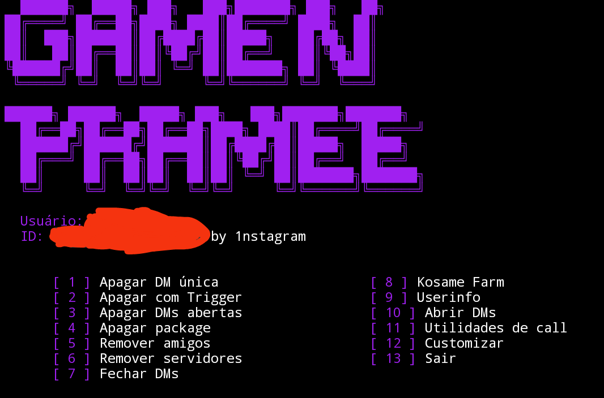

# Clear Account - Discord Account Cleaner 🚀

**Clear Account** is a powerful tool designed to create **completely new and history-free Discord accounts**. Perfect for those who want a fresh start on Discord, free from bans, restrictions, or unwanted traces. Ideal for privacy, rejoining communities, or simply resetting your Discord experience.

---

## ✨ Features

- ✅ Create a **brand-new Discord account** with no prior history.
- 🚫 Free from previous bans, flags, or restrictions.
- 🔒 Ensures **privacy and anonymity**.
- 🔄 Reset your Discord experience effortlessly.

---

## 📋 Requirements

- **Node.js** (version 16 or higher recommended)
- **Discord.js** (for interacting with the Discord API)
- **NPM** (for package management)

---

## 🛠️ Installation

1. Clone or download this repository:

   ```bash
   git clone https://github.com/01nstagram/Clear-Account.git
   ```

2. Navigate to the project folder:

   ```bash
   cd Clear-Account
   ```

3. Install dependencies:

   ```bash
   npm install
   ```

4. Configure the tool by modifying the configuration file (if applicable).

---

## 🚀 Usage

1. Open your terminal and navigate to the project folder.

2. Run the tool using the following command:

   ```bash
   node index.js
   ```

3. Follow the on-screen prompts to create a new Discord account or clear your existing account's history.

---

## 📸 Screenshot

Below is a screenshot of the **Clear Account** tool interface:



---

## 🤝 Contributing

Contributions are welcome! Feel free to fork the project, open issues, and submit pull requests. Check out the [Contribution Guidelines](CONTRIBUTING.md) for more details.

---

## 📜 License

This project is licensed under the **MIT License**. See the [LICENSE](LICENSE) file for details.
